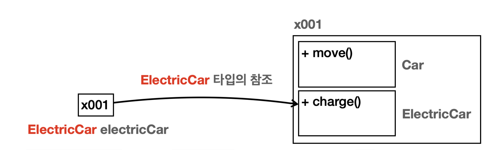

## 상속 관계
- 상속은 객체 지향 프로그래밍의 핵심 요소 중 하나로, 기존 클래스의 필드와 메서드를 새로운 클래스에서 재사용하게 해준다. 
- 이름 그대로 기존 클래스의 속성과 기능을 그대로 물려받는 것이다.
- 상속을 사용하려면 `extends` 키워드를 사용 하면 된다. 그리고 `extends` **대상은 하나만 선택**할 수 있다.


### 용어 정리
- 부모 클래스 (슈퍼 클래스)
  - 상속을 통해 자신의 필드와 메서드를 다른 클래스에 제공하는 클래스 
- 자식 클래스 (서브 클래스)
  - 부모 클래스로부터 필드와 메서드를 상속받는 클래스


---

## 단일 상속
- 참고로 자바는 다중 상속을 지원하지 않는다.
- 그래서 `extend` 대상은 하나만 선택할 수 있다. 부모를 하나만 선택할 수 있다는 뜻이다.
- 물론 부모가, 또 다른 부모를 하나 가지는 것은 괜찮다.


--- 

### 상속과 메모리 구조
- **이 부분을 제대로 이해하는 것이 앞으로 정말 중요하다!** 상속 관계를 객체로 생성할 때 메모리 구조를 확인해보자.

```java
ElectricCar electricCar = new ElectricCar(); 
```

<div align="center">
    
</div>


- `new ElectricCar()` 를 호출하면 `ElectricCar` 뿐만 아니라 상속 관계에 있는 `Car` 까지 함께 포함해서 인스턴 스를 생성한다. 
- 참조값은 `x001` 로 하나이지만 실제로 그 안에서는 `Car` , `ElectricCar` 라는 두가지 클래스 정보가 공존하는 것이다.
- 상속이라고 해서 단순하게 부모의 필드와 메서드만 물려 받는게 아니다.
- 상속 관계를 사용하면 부모 클래스도 함께 포함 해서 생성된다.
- 외부에서 볼때는 하나의 인스턴스를 생성하는 것 같지만 내부에서는 부모와 자식이 모두 생성되고 공간 도 구분된다.


#### **지금까지 설명한 상속과 메모리 구조는 반드시 이해해야 한다!**
- 상속 관계의 객체를 생성하면 그 내부에는 부모와 자식이 모두 생성된다.
- 상속 관계의 객체를 호출할 때, 대상 타입을 정해야 한다. 이때 호출자의 타입을 통해 대상 타입을 찾는다.
- 현재 타입에서 기능을 찾지 못하면 상위 부모 타입으로 기능을 찾아서 실행한다. 기능을 찾지 못하면 컴파일 오류가 발생한다.


---

## super - 생성자
- 상속 관계의 인스턴스를 생성하면 결국 메모리 내부에는 자식과 부모 클래스가 각각 다 만들어진다. 
- `Child` 를 만들면 부모인 `Parent` 까지 함께 만들어지는 것이다. 따라서 각각의 생성자도 모두 호출되어야 한다.
- **상속 관계를 사용하면 자식 클래스의 생성자에서 부모 클래스의 생성자를 반드시 호출해야 한다.(규칙)**
- 상속 관계에서 부모의 생성자를 호출할 때는 `super(...)` 를 사용하면 된다.